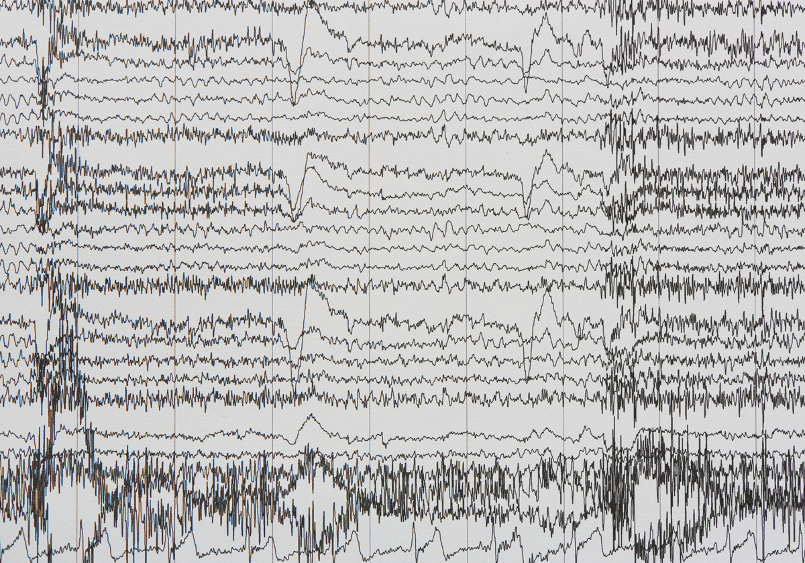

# Thought in Motion: A State-of-the-Art Survey on Motor Imagery Decoding from EEG

<h1 align="center">

</h1>


## Description

This project analyzes over 5 GB of EEG data to develop a robust classifier for Motor Imagery (MI). Our goal is threefold: to provide the user with a practical insight on the latest trends, techniques and surveys related to the modelling, preprocessing, and representation of EEG data, to build a high-accuracy predictive model for Brain-Computer Interfaces (BCI), and to serve as a practical tutorial and best-practice guide for handling complex neurophysiological data.

### Classification Tasks
We address three progressively challenging tasks, aiming for high accuracy across all scales of motor representation:

| Task | Classes | Description | Difficulty |
| :--- | :--- | :--- | :--- |
| **I** | 3 | Left Hand, Right Hand, Passive | Standard |
| **II** | 6 | Hand/Leg/Tongue movements & Passive | Advanced |
| **III** | 5 | **Individual Five Fingers** movement | **Challenging** |


## Contents

The directory is structured in the following way:

- **src**: Contains the notebooks used throughout the experimentation and other source code. 
- **resources**: Contains past years examples, images and related publications.
- **documents**: Final report and report template.

## TODO

Our current roadmap is:

- Pre-processing techniques
    1. Compression? 
    2. Clustering?
    3. Autoencoding?
    4. ???
- Data representations (classic feature extraction, spectral representation, etc …) 
    1. Classic Feature Extraction
    2. Spectral Representations
    3. ???
- Different NN architectures (novel, or combinations of existing ones)
    1. CNNs?
    2. GNNs?
    3. SNNs? (Prof. Rossi said its a bad approach)

## Models Survey:

The models that have been presented in the literature have been always revolving both sequences (temporal data) and convolutions (multiple signal channels). The are the branches of neural networks that we can explore: 

1) Convolutional temporal neural networks:

- [EEGNet (2018)](https://github.com/amrzhd/EEGNet)
- [EEGInception (2021)](https://github.com/esantamariavazquez/EEG-Inception/tree/main)
- [ATCNet (2022)](https://github.com/Altaheri/EEG-ATCNet/tree/main)
- [EEGConformer (2022)](https://github.com/eeyhsong/EEG-Conformer)
- [EEGNex (2022)](https://github.com/chenxiachan/EEGNeX)
- [LMDA Code (2023)](https://github.com/MiaoZhengQing/LMDA-Code)
- [EEGPT (2024)](https://github.com/BINE022/EEGPT)
- [EEGDeformer (2024)](https://github.com/yi-ding-cs/EEG-Deformer)
- [TCFormer (2025)](https://github.com/Altaheri/TCFormer)


2) Graph Neural Networks:

- [ST-GNN (2021)](https://github.com/LMissher/STGNN)
- [NexusNet (2025)](https://github.com/ZikaiVan/NexusNet) 

Many of this models can be found or acessed through the [Braindecode library](https://braindecode.org/stable/index.html).

## Usage 

### 0. Virtual Environment 

> WARNING: Its recommended to create a virtual environment  (venv / pyenv or conda) to ensure full reproducibility, using python 3.12.11 and the fixed requirements inside of requirements.txt file. 

In order to create a virtual environment using conda:

```sh
#Create environment:
conda env create -f environment.yml
#activate:
conda activate machine-learning-env
#check:
python src/utils/env_check.py
```

To create a virtual environment using pyenv:

```sh
# Install python 3.12.11
pyenv install 3.11.13
# Create the virtual environment ML4HD
pyenv virtualenv 3.11.13 ml4hd
# Activate it 
pyenv activate
# Make it the default environment for this project
pyenv local ml4hd 
# Install the dependencies using pip
pip install -r requirements.txt
```

### 1. Executing the Pipelines 

In order to inspect and execute the different solutions and data pipelines that have been built for this project, refer to the main notebooks inside of main **src/** directory, also refer to the drive collab versions for more GPU compute power:

1. CNNs solution
2. GNNs solution
3. SNNs solution

**WORK IN PROGRESS**

